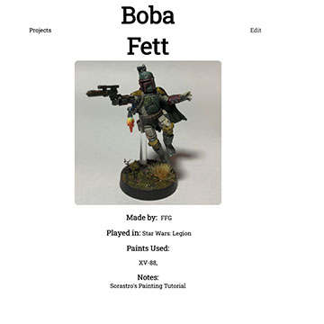

# SEIR-Project-2: Colour Journal

For my second project at General Assembly I chose to build an application that could assist me in my hobby of miniatures painting. The purpose of this app is to allow me to catalog all of my painting projects and to keep a working inventory of my paint collection. 

## Features

* Users can create, access, and manage their own painting projects
* Projects are stored as a document in a MongoDB database and readily available for reference, with full CRUD functionality
* Users can keep detailed notes about each project stored with the project document
* Users can use the paint inventory management system to add/remove paints from their collection in the database

## Technologies Used

* MEHN Stack
* HTML, CSS, Javascript
* Node.js
* Express
* Handlebars
* MongoDB
* Mongoose
* Heroku deployed; MongoDB Atlas

## Future Additions
* Search option
* User authentication for individualized collections
* Complete the "Browse by Topic" feature where users can browse from a list of relevant topics
* Complete the "My Collection" option where users can organize their collections of miniatures into related groups
* Add a photo upload feature

